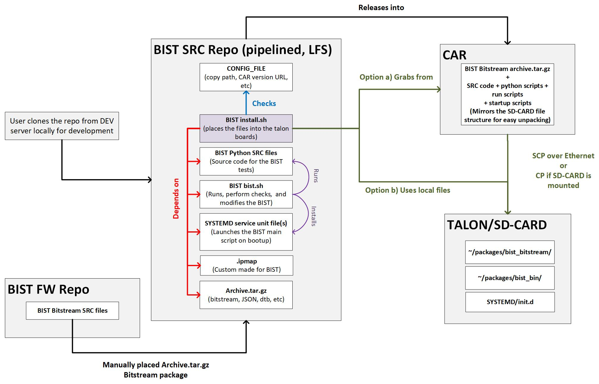

# Intro

This repository holds the Built In Self Test (BIST) for the Talons. It provides the source code to run the BIST, the bitstream to program, and a script that manages the BIST start, stop, and delay on the target system.

<div align="center">
<br>
Figure 1. BIST Deployment Architecture</div><br>

## How to Install

1. Grab the package from CAR.
2. Transfer the package to the target device via SCP. 
   
    ```scp <bist_archive.tar.gz> root@<target>:/home/root/packages```

3. Unpack the package at root on the target device. 

    ```tar -xvzf bist_archive.tar.gz -C /```

4. Run `bist -v` to verify the files.
5. Run `bist -s` to install the BIST systemd service.
6. Run `bist -x` to extract the bitstream tar file.
7. Restart the target device, the BIST will run automatically on boot-up.

## How to Use

The BIST is deployed through the CAR (Central Artifact Repository). The package grabbed from CAR mirrors the file system of the target talon boards. This has been done to simplify the process of deployment, because once the tar.gz package is unpacked at root, all the necessary files and scripts would be placed at the correct location, granted the structure of this repository was set correctly.

For example a given package `bist_archive.tar.gz` could be unpacked at root:
```
tar -xvzf bist_archive.tar.gz -C /
```

This would place the `bist` script at `/bin`. The user may then call this script to perform various actions.

### Available Actions

The idea is that the BIST will start automatically on each boot-up to run a system diagnostic. However, a small delay is introduced before this service is started in case it is required to stop it from running. This delay is managed by `bist.timer` service and could be modified by the `bist` script.

The automatic startup is achieved via the systemd service (unit files). The `bist.service` is triggered by `bist.timer`. The user may kill the BIST runner before it is triggered by `bist.timer` via the bist script.

Run the `bist` script (or `bist -h`) to view the available commands.

- "-s             Start the BIST systemd service"
- "-k             Kill the BIST systemd service immediately, aborting the BIST"
- "-r             Run the BIST"
- "-m <time>      Modify the BIST systemd start delay time by <time>"
- "-t             Show the current BIST systemd start delay time"
- "-p             Program the BIST bitstream"
- "-x             Extract the tar file at predefined location"
- "-h             Display the help message"
- "-v             Verify the BIST files are installed correctly"

The `-s` option installs the BIST runner service in systemd. The user might need to run this command only once per BIST package installation.

The `-k` option kills and stops the BIST runner service. Note that this also prevents the start of the BIST on future bootups, the user may run the `-s` option to reinstall the service.

The `-t` option shows the current set BIST start delay.

The `-m` option allows the user to modify the delay from within the target environment.
For example to set the start delay to 99 seconds after boot:
```
bist -m 99
```

The status of a given systemd service could be read by:
```
systemctl status bist.timer
systemctl status bist.service
journalctl -u bist.timer
```

The `-v` option verifies that the bitstream files and the service files are placed (unpacked) at the correct location.

The `-r` option runs the bist. Note that the systemd `bist.service` uses this same script to run the BIST after the required bootup delay.

## TODOS
- [ ] Display the BIST output results
- [ ] Verify the python dependencies are installed on the target
- [ ] Allow override of the installation path/binary/packages via the `install.sh` and a `CONFIG_FILE`
- [ ] Publish the results of the BIST to influxdb periodically
- [ ] Add the official .ipmap
- [ ] Add the official bitstream archive.tar.gz
