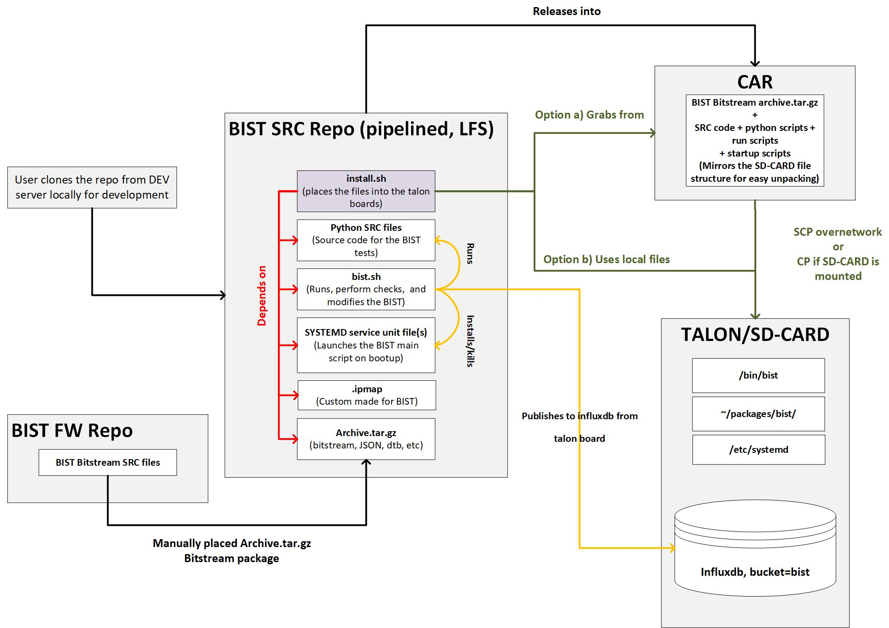

Table of Contents
=================

- [Table of Contents](#table-of-contents)
- [Intro](#intro)
  - [BIST Python Code](#bist-python-code)
  - [BIST Deployment](#bist-deployment)
  - [BIST Influxdb](#bist-influxdb)
  - [BIST and QSPI Image](#bist-and-qspi-image)
- [How to Install](#how-to-install)
  - [Via Scripts](#via-scripts)
  - [Manual Method](#manual-method)
- [Using the "./scripts/install.sh" script](#using-the-scriptsinstallsh-script)
- [Using the on-board "/bin/bist.sh" script](#using-the-on-board-binbistsh-script)
    - [Available Actions](#available-actions)
- [Releasing into CAR](#releasing-into-car)
  - [Testing](#testing)
  - [Releasing](#releasing)

# Intro

This repository holds the Built In Self Test (BIST) for the Talons. It provides the source code to run the BIST, the bitstream to program, and a script that manages the BIST start, stop, and delay on the target system.

<div align="center">
<br>
Figure 1. BIST Deployment Architecture</div><br>

## BIST Python Code
The BIST is made out of a series of python scripts that test various aspects of the design. It is run on boot-up and the the most recent results are published to a database on the board. The python scripts rely on the register definitions (.json and .ipamp) and helper function under "py_reg_sets."

The BIST also requires the bitstream to be loaded at boot-up. There exists two scripts - `bist.sh` and `install.sh` that faciliates various aspects of the BIST deployment, set-up, verification, running and publishing.

## BIST Deployment
The BIST is deployed on a given board in two steps.
1. Getting the required files onto a board/sd-card.
2. Setting up the services and files on a given board. 

## BIST Influxdb 
The results of the BIST test are saved as a .csv file. The output is then pushed to the influxdb on a given board using the influx CLI toolkit.
A dry-run of the publish could be done via:
```
influx write dryrun --bucket bist --file ./tdc_base_bist_logfile.csv
```
A sample of the BIST output .csv is located under the assets folder. The influx bucket that holds the results is named `bist`.
To List the bucket on a given board:
```
influx bucket ls
```
The Results can be queried from the influx database by various methods. Refer to the influx Documention for more info. As an example, you may query the results for the `talon_ber_status` for the past 10hours with the following command:
```
influx query 'from(bucket: "bist") |> range(start: -10h) |> filter(fn: (r) => r._measurement == "talon_ber_status") |> drop(columns: ["_start", "_stop", "_time"])'
```
## BIST and QSPI Image
The BIST assumes the bitstream is compatible with the QSPI image that is already on the board. It does not do any checks to confirm the compatibility and proceeds to attempt to program the bitstream on boot-up. Make sure the QSPI image is compatible with the BIST by programming it beforehand (either through the .jic file for JTAG programming or using the Remote System Update feature).

# How to Install
## Via Scripts
The most straight forward method is to have network access to a talon board. The BIST package can then be either downloaded from CAR (Central Artifact Repository) or generated from this repo localy. This installs the BIST on a given board and sets it up to run on boot-up. Run the following commands from the root of the repo.

- `./scripts/install.sh -c 0.1.0 -s talon1 -b talon1` (from CAR)
- `./scripts/install.sh -n my_bist.tar.gz -g -s talon1 -b talon1` (local generation)

## Manual Method
It can also be installed manually on a given board. The scripts are in essense doing these steps.

1. Grab the package from CAR.
2. Transfer the package to the target device via SCP: 
   
    ```
    scp <bist_archive.tar.gz> root@<target>:/home/root/packages
    ```

3. SSH into the the target device and unpack the package at root on the target device: 

    ```
    $ssh root@<target>
    $tar -xvzf bist_archive.tar.gz -C /
    ```

4. On the target device, run `bist.sh -v` to verify the files.
5. On the target device, run `bist.sh -s` to install the BIST systemd service and extract the required BIST bitstream files.
6. Restart the target device; the BIST will run automatically on boot-up.
   
# Using the "./scripts/install.sh" script
The install.sh script provides some additional functionality for generation and deployment of the bist.
Only generate a local package
```
$./scripts/install.sh -n my_bist.tar.gz -g
```
Only download the package from CAR
```
$./scripts/install.sh -c 0.1.0
```
Only transfer and unpack the package over network (SCP & SSH)
```
Package from CAR
$./scripts/install.sh -c 0.1.0 -s talon1

Local package
$./scripts/install.sh -n my_bist.tar.gz -s talon1
```
Only transfer and unpack the package if the sd-card is mounted:
```
Package from CAR
$./scripts/install.sh -c 0.1.0 -i /mnt/p2/

Local package
$./scripts/install.sh -n my_bist.tar.gz -i /mnt/p2/
```
# Using the on-board "/bin/bist.sh" script
The package grabbed from CAR mirrors the file system of the target talon boards. This has been done to simplify the process of deployment, because once the tar.gz package is unpacked at root on a given target talon board, all the necessary files and scripts would be placed at the correct location, granted the structure of this repository was set correctly.

For example a given package `bist_archive.tar.gz` could be unpacked at root:
```
$ssh root@<target>
$tar -xvzf bist_archive.tar.gz -C /
```
This would place the `bist.sh` script at `/bin`. The user may then call this script to perform various actions.

### Available Actions
The intent is that the BIST will start automatically on each boot-up to run a system diagnostic. However, a small delay is introduced before this service is started in case it is required to stop it from running. This delay is managed by `bist.timer` service and could be modified by the `bist.sh` script.

The automatic startup is achieved via the systemd service (unit files). The `bist.service` is triggered by `bist.timer`. The user may kill the BIST runner before it is triggered by `bist.timer` via the bist script.

Run the `bist.sh` script to view the available commands.

- -s&emsp;--> Start the BIST systemd service and exract the bitstream tar file
- -k&emsp;--> Kill the BIST systemd service immediately, aborting the BIST
- -r&emsp;--> Run the BIST
- -m [time] --> Modify the BIST systemd start delay time by <time>
- -t&emsp;--> Show the current BIST systemd start delay time
- -p&emsp;--> Program the BIST bitstream
- -x&emsp;--> Extract the tar file at predefined location
- -f&emsp;--> Publish the results (.csv) of the BIST to influxdb
- -c&emsp;--> Print the results (.log) of the BIST
- -h&emsp;--> Display the help message
- -v&emsp;--> Verify the BIST files are installed correctly

The `-s` option installs the BIST runner service in systemd and extracts the BIST bitstream related files. The user might need to run this command only once per BIST package installation.

The `-k` option kills and stops the BIST runner service. Note that this also prevents the start of the BIST on future bootups, the user may run the `-s` option to reinstall the service.

The `-t` option shows the current set BIST start delay.

The `-m` option allows the user to modify the delay from within the target environment.
For example to set the start delay to 99 seconds after boot:
```
$ssh root@<target>
$bist -m 99
```
The status of a given systemd service could be read by:
```
$ssh root@<target>
$systemctl status bist.timer
$systemctl status bist.service
or
$journalctl -u bist.timer
```
The remaining time before the BIST is run can be polled:
```
systemctl list-timers --all
```
The `-v` option verifies that the bitstream files and the service files are placed (unpacked) at the correct location. It also verifies the BIST influxdb bucket is started. If it is not, it will automatically create it.

The `-r` option runs the bist. Note that the systemd `bist.service` uses this same script to run the BIST after the required bootup delay.

The `-x` option extracts the BIST bitstream related package (.tar.gz) at a predefined location. The execution of the BIST and programming of the FPGA relies on the existence of this directory.

The `-c` option prints the results (.txt) of the most recent BIST to the screen with $cat command. 

The `-f` publishes the results of the most recent BIST output (.csv) to the influxdb database. It publishes the results via the influx CLI and requires the bucket named `bist` to exist on the target and the influxdb credentials are already setup on the board.

# Releasing into CAR
## Testing
Before releasing into CAR, make sure the package that is going to be generated is fully working.
1. Pull from the main branch
2. Generate a local package<br>`./scripts/install.sh -n test_bist.tar.gz -g`
3. Inspect and make sure the contents are correct, the local generation process procudes a warning if permissions are not as expected.
4. Once you are sure the contents are correct, install the package on the board, for example over network and set-it up via the script (end-to-end)<br>`./scripts/install.sh -n test_bist.tar.gz -s talon1 -b talon1`
5.  ssh into the board and once again verify that the files are setup correctly. This may be done using the now unpacked `/bin/bist.sh` script and passing it the `-v` and `-t` options to verify the files and print the bist start up delay
6.  Run `bist.sh -s` to setup the BIST systemd services.
7.  Restart the board and verify that the BIST ran on bootup and the results were generated and logged.  

## Releasing
The package is automatically released into CAR once the main branch is tagged.
1. On branch `main`, add the files to `raw/ska-mid-cbf-talondx-bist/`. Each sub-directory of `raw/` prefixed with `ska-` will be packaged and uploaded to the CAR separately upon tag pipeline success, so delete any directories not intended for release; currently, only the `ska-mid-cbf-talondx-bist` package is used.
2. Update the `.release` file; if simply incrementing the current semver, you can use the following make rules: `make bump-patch-release`, `make bump-minor-release` or `make bump-major-release`, or do it manually.
3. Tag the release. The package will be published into CAR